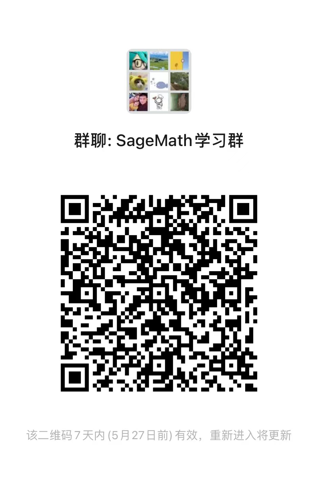

# sagemath_learning

## Tutorial

[使用docker运行SageMath服务，简单介绍通过浏览器和VSCode运行脚本（推荐个人或教学使用）](sage_docker/README.md)

[基于Windows搭建SageMath开发环境，并且运行Python脚本（适合研究SageMath源代码）](sage_test/README.md)

## WIP

[比特币核心算法secp256k1，Python实现与验证](secp256k1_python/README.md)

[比特币核心算法secp256k1，Java实现与验证](secp256k1_java/README.md)

[告诉你私钥也无法取走的比特币(上)](bitcoin_lost/README.md)

[告诉你私钥也无法取走的比特币(下)原理讲解](bitcoin_lost/README.md)

[使用SageMath，根据公钥计算私钥，比特币核心算法secp256k1破解](sage_secp256k1/README.md)

## 加入学习群

国内使用SageMath的人比较少，近些年大学开设了密码科学与技术和信息安全专业学习的人才有了一些，如果有交流学习的可以扫码加入或者加我微信: discrete_log ,备注来源: sage

