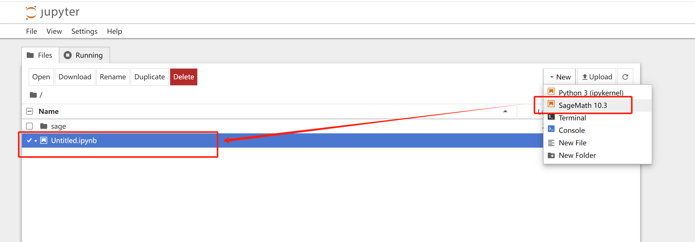
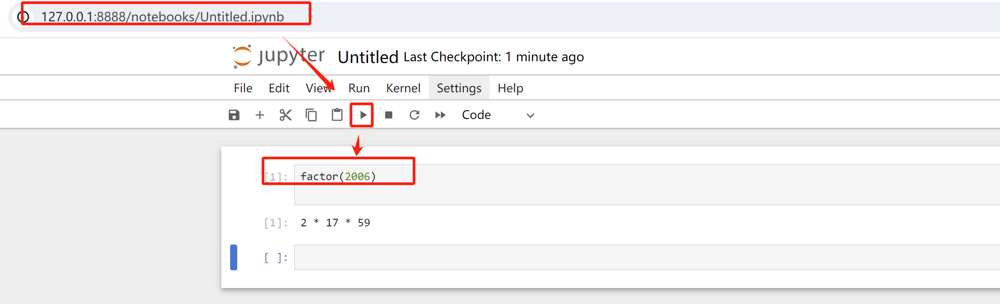
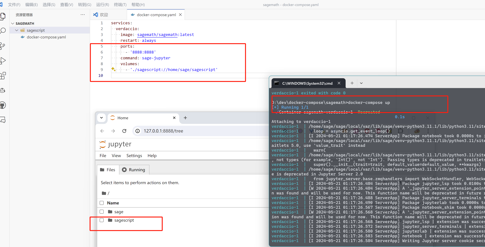
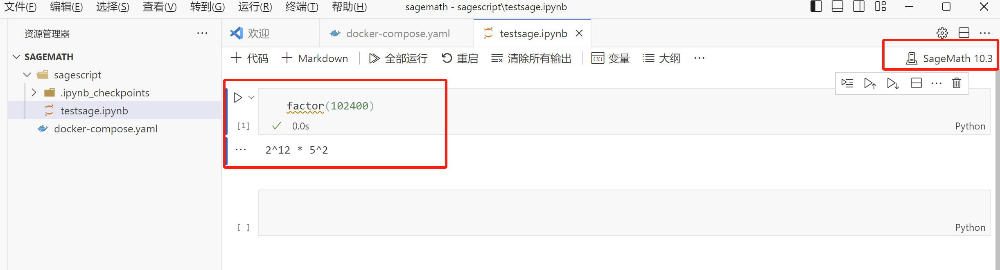
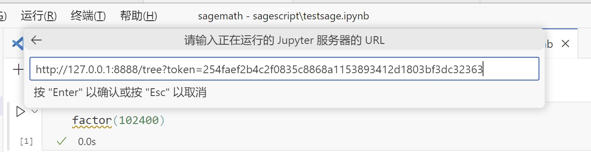
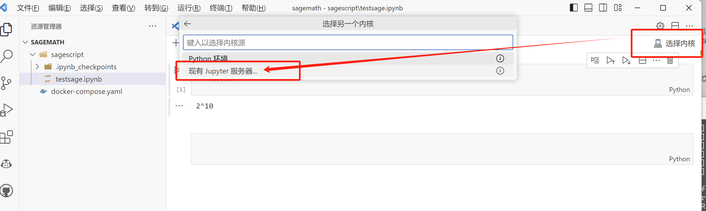

# 使用docker运行SageMath服务，简单介绍通过浏览器和VSCode运行脚本（推荐个人或教学使用）

## 前置学习条件：

* 会基础的 docker 安装使用
* 会 VSCode 安装使用

## 下载镜像并且运行

访问sagemath 镜像主页：

https://hub.docker.com/r/sagemath/sagemath

### 运行方式一

```
docker run -p8888:8888 sagemath/sagemath:latest sage-jupyter
```

运行取来服务后在命令行控制台（终端）找到启动日志中类似于：

http://127.0.0.1:8888/tree?token=254faef2b4c2f0835c8868a1153893412d1803bf3dc32363


的地址在浏览器中打开，就可以通过浏览器运行sage脚本了，如果是远程服务器修改服务器的IP地址进行访问





### 运行方式二（推荐）

要求会些 docker-compose 用法

同时将`sagescript`文件中脚本夹挂载到容器中

```
docker-compose up
```

docker-compose.yaml 配置文件
```
services:
  sagemath:
    image: sagemath/sagemath:latest
    restart: always
    ports:
      - '8888:8888'
    command: sage-jupyter
    volumes:
      - './sagescript:/home/sage/sagescript'

```

注意图中的目录结构



在VSCode中，编辑窗口右上角选择配置运行的jupyter服务器



填入jupyter服务器的地址





