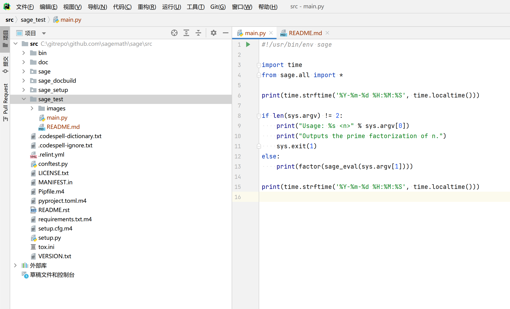
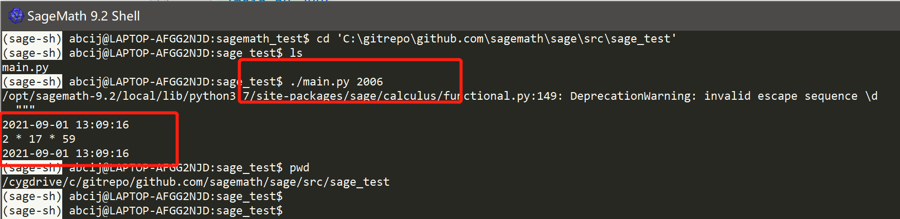

# 基于Windows搭建SageMath开发环境,并且运行Python脚本

## 0.下载安装SageMath

https://www.sagemath.org/download.html

## 1.下载SageMath源码
```
cd  C:\gitrepo
git clone  https://github.com/sagemath/sage github.com/sagemath/sage
```
## 2.使用PyCharm打开SageMath源码目录,使用源码为基础项目,可以正常引用SageMath数学函数方法
```
C:\gitrepo\github.com\sagemath\sage\src
```
创建文件夹 sage_test和脚本main.py

教程:
```
https://www.osgeo.cn/sagemath/tutorial/programming.html#standalone-python-sage-scripts
```

## 3.代码示例:
```python
#!/usr/bin/env sage

import sys
from sage.all import *

if len(sys.argv) != 2:
    print("Usage: %s <n>" % sys.argv[0])
    print("Outputs the prime factorization of n.")
    sys.exit(1)

print(factor(sage_eval(sys.argv[1])))

```


## 4.打开程序 SageMath 9.x Shell

进入sage_test目录

```shell
cd /cygdrive/c/gitrepo/github.com/sagemath/sage/src/sage_test
```

## 5.运行Python脚本,整数分解

```shell
./main.py 2006
```

输出

```
2021-09-01 13:09:16
2 * 17 * 59
2021-09-01 13:09:16
```




## 6.为什么这样搭建搭建SageMath开发环境?

因为我常用的开发电脑是Windows,如果是Mac或者Ubuntu应该更简单些.

官方介绍的一些IDE环境都是好几年前的了,都尝试过了一遍,没有能够在Windows上正常使用的,sage-support谷歌组里面是建议使用sage-shell,然后编码使用PyCharm.

感觉国内使用SageMath的人比较少,如果有交流学习的可以加我微信: discrete_log ,备注来源: sage

https://wiki.sagemath.org/IDE

https://ask.sagemath.org/question/39742/make-pycharm-recognise-the-sage-python-interpreter/

https://ask.sagemath.org/question/38750/how-i-use-sage-with-pycharm-in-ubuntu/

https://groups.google.com/g/sage-support/c/wOY6N0f7t4w/m/I2-AnoR9BAAJ

https://blog.csdn.net/hardwork617s/article/details/110875291

https://blog.csdn.net/gridrender/article/details/118411215


## SageMath使用教程

中文文档:https://www.osgeo.cn/sagemath/

官方文档:https://doc.sagemath.org/index.html